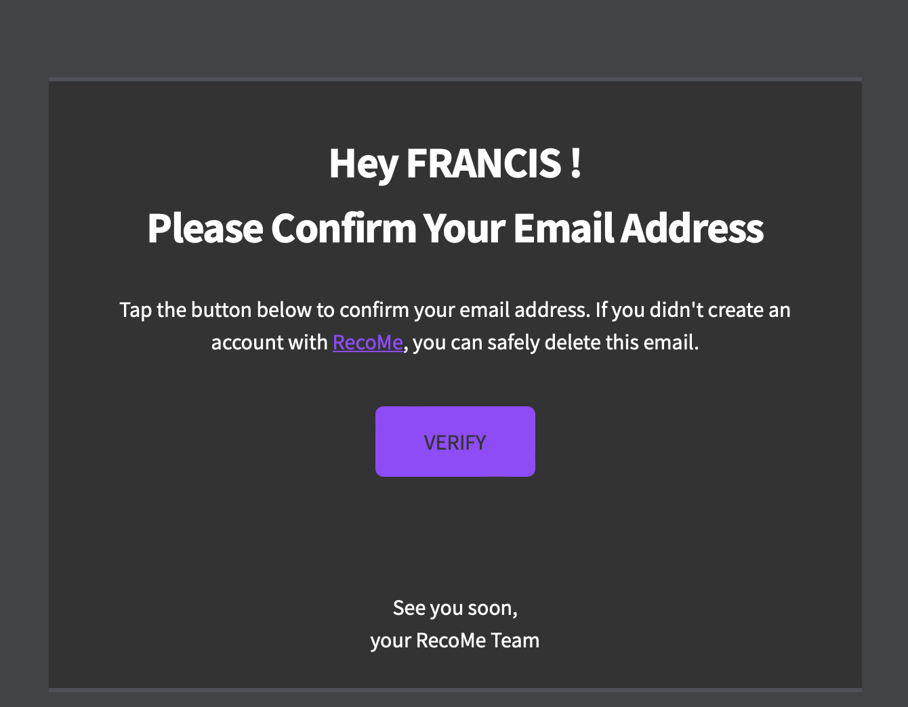
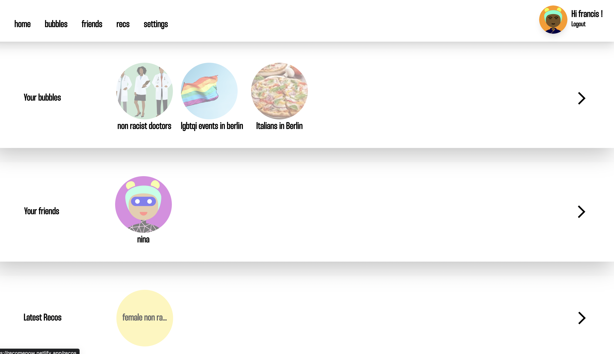
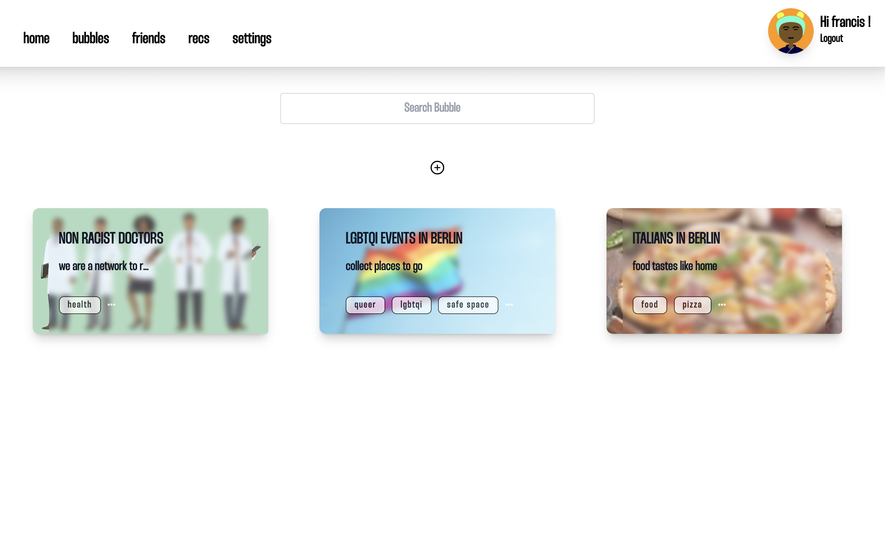
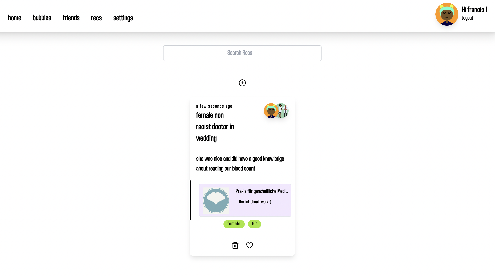
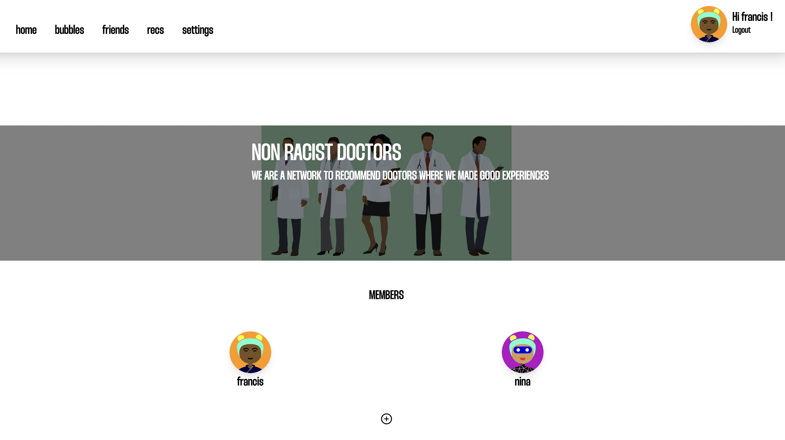
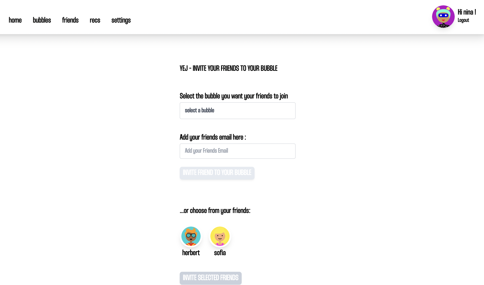
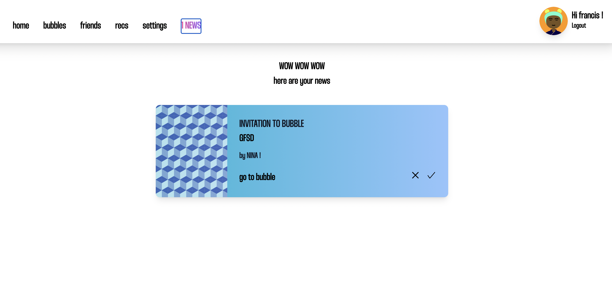
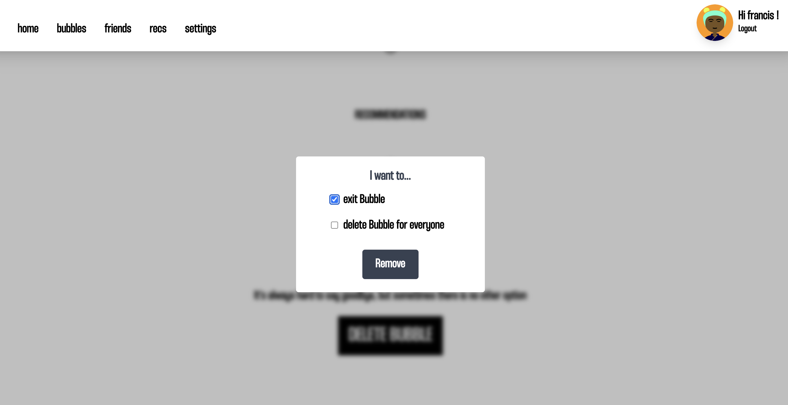

# recoMe
I started this project as my first fullstack web app and I'm continuously improving it. My idea behind it was to solve the problem of finding the recommendations I got a long time ago in one of the thousand social media channels and couldn't remember where.

check out the Backend <a href="https://github.com/loerk/RecoME-backend" target="_blank">here</a>

<!-- FEATURES -->

## Features
### Email Confirmation

### Landing Overview 

### Bubbles Overview 

### Recommendations Overview 

### Bubble 

### Invite Friends 

### Notifications 

### Exit Bubble

## Technologies

### Frontend

&nbsp;&nbsp;

### Backend

&nbsp;&nbsp;&nbsp;

### Try it out
>please be aware you have to confirm your registration via email  

[recoMe](https://recomenow.netlify.app/)
